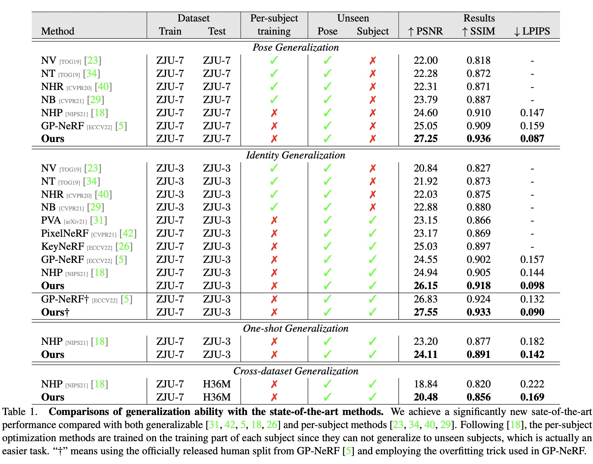
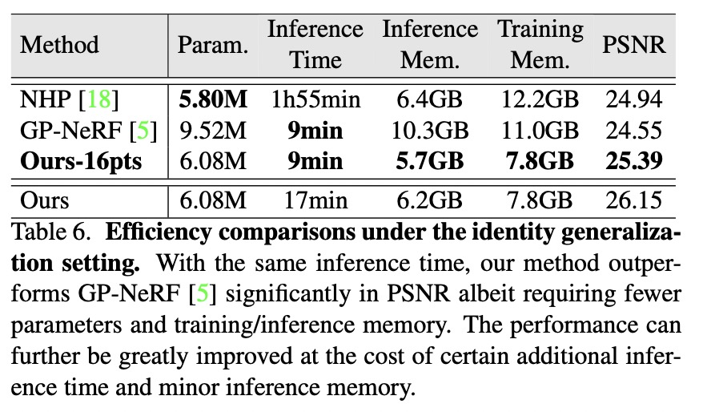
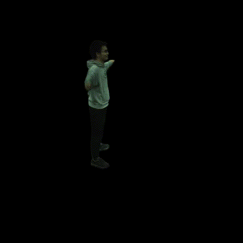
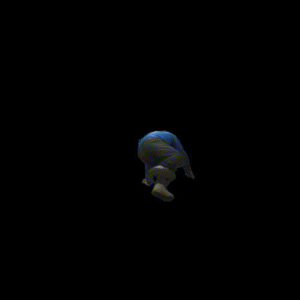

**News**
* `05/08/2023` The code and the pretrained model are released!


<br><br>

# TransHuman

Official code for ICCV 2023 paper:

**TransHuman: A Transformer-based Human Representation for Generalizable Neural Human Rendering**
<br>
[Xiao Pan](https://pansanity666.github.io/)<sup>1,2</sup>, [Zongxin Yang](https://z-x-yang.github.io/)<sup>1</sup>, [Jianxin Ma](https://jianxinma.github.io/)<sup>2</sup>, [Chang Zhou](https://scholar.google.com/citations?user=QeSoG3sAAAAJ&hl=zh-CN)<sup>2</sup>, [Yi Yang](https://scholar.google.com/citations?user=RMSuNFwAAAAJ&hl=en)<sup>1</sup>
<br>
<sup>1</sup> ReLER Lab, CCAI, Zhejiang University; <sup>2</sup> Alibaba DAMO Academy

[[Project Page](https://pansanity666.github.io/TransHuman/) | [arXiv](http://arxiv.org/abs/2307.12291)]


* We present a brand-new framework named TransHuman for generalizable neural human rendering, which learns the painted SMPL under the canonical space and captures the global relationships between human parts with transformers.

<p float="left" align="middle">
 
</p>

* We achieve SOTA performance on various settings and datasets.

<p float="left" align="middle">
  
</p>

* We also have better efficiency. 

<p float="left" align="middle">
 
</p>


<br><br>

# Environment 

We test with:

* python==3.6.12
* pytorch==1.10.2
* cuda==11.3

```shell
# under TransHuman dir

# create conda environment
conda create -n transhuman python=3.6 
conda activate transhuman

# make sure that the pytorch cuda is consistent with the system cuda
# install pytorch via conda
https://pytorch.org/get-started/locally/

# install requirements 
pip install -r requirements.txt

# install pytorch3d (we build from source)
https://github.com/facebookresearch/pytorch3d/blob/main/INSTALL.md

```


<br><br>

# Dataset Preparation

### ZJU-MoCap

  Please follow [NHP](https://github.com/YoungJoongUNC/Neural_Human_Performer/blob/main/INSTALL.md#set-up-datasets) to prepare the ZJU-MoCap dataset. 

  The final structure of ```data``` folder should be:
  ```shell
  # under TransHuman dir
  -data
    -smplx
      - smpl
      - ...
    -zju_mocap
      - CoreView_313
      - ...
    -zju_rasterization
      - CoreView_313
      - ...
  ```

TODO: Code for more datasets are coming.


<br><br>

# Training
  ```shell
  sh ./scripts/train.sh
  ```

  The checkpoints will be saved under ```./data/trained_model/transhuman/$EXP_NAME ```.


<br><br>

# Evaluation 
```shell
sh ./scripts/test.sh $GPU_NUMBER $EPOCH_NUMBER $EXP_NAME 
```
The config of different settings are provided in ```test.sh```. Modify them as you need. 


For reproducing the results in the paper, please download the official checkpoints from [here](https://drive.google.com/file/d/1olUdXPY9woq1TnUo5h9VzTwQwJhqNpFz/view?usp=sharing).

Put it under ```./data/trained_model/transhuman/official```, and run:
```shell
sh ./scripts/test.sh 0 2100 official 
```


<br><br>

# Visualization 

### Free-viewpoint video 

<p float="left" align="middle">
     
</p>

  1. Render the free-viewpoint frames via running:
      ```shell
      sh ./scripts/video.sh $GPU_NUMBER $EPOCH_NUMBER $EXP_NAME  
      ```
      The rendered frames will be saved under ```./data/perform/$EXP_NAME```. 

  2. Use ```gen_freeview_video.py``` for getting the final video. 

### Mech reconstruction 

<p float="left" align="middle">
 
</p>

1. Extract the mesh via running:
    ```shell
    sh ./script/mesh.sh $GPU_NUMBER $EPOCH_NUMBER $EXP_NAME  
    ```
    The meshes will be saved under ```./data/mesh/$EXP_NAME``` .

2. Render the meshes using ```render_mesh_dynamic.py```. The rendered frames will also be saved under ```./data/mesh/$EXP_NAME```

3. Use ```gen_freeview_video.py``` for getting the final video. 


<br><br>

# Citation 
If you find our work useful, please kindly cite:
```
@misc{pan2023transhuman,
        title={TransHuman: A Transformer-based Human Representation for Generalizable Neural Human Rendering}, 
        author={Xiao Pan and Zongxin Yang and Jianxin Ma and Chang Zhou and Yi Yang},
        year={2023},
        eprint={2307.12291},
        archivePrefix={arXiv},
        primaryClass={cs.CV}
  }
```

<br><br>

# Contact
For questions, feel free to contact xiaopan@zju.edu.cn.

<br><br>

# Acknowledgments
This project is mainly based on the code from [NHP](https://github.com/YoungJoongUNC/Neural_Human_Performer#readme) . We also thank Sida Peng of Zhejiang University for helpful discussions on details of ZJU-MoCap dataset. 


